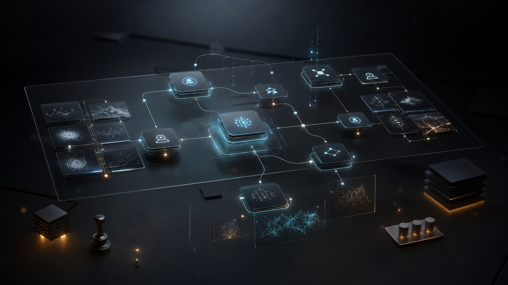
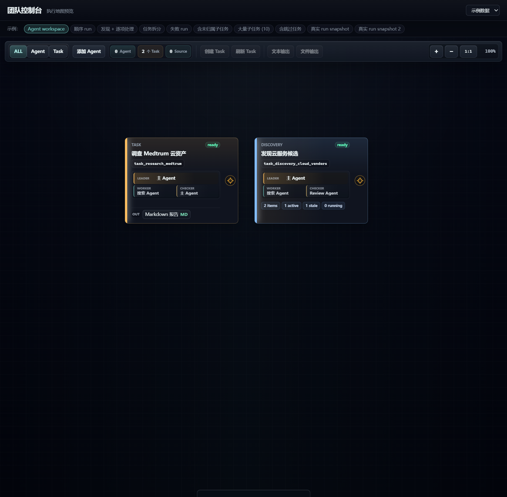
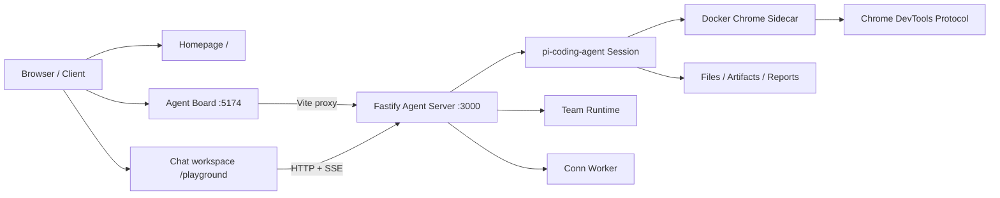

<p align="center">
  
</p>

<h1 align="center">UGK CLAW</h1>

<p align="center">
  <strong>Make every agent task reviewable before delivery.</strong><br>
  Use clean Tasks, reusable Skills, Worker execution traces, and Checker review to turn agent output into deliverable work units.
</p>

<p align="center">
  <a href="./README.md">中文</a>
  |
  <a href="./README.en.md">English</a>
  |
  <a href="./apps/team-console/README.md">Team Console</a>
  |
  <a href="./docs/playground-current.md">Playground</a>
</p>

---

## What It Is

UGK CLAW is a local-first, self-hosted **agent task acceptance and workflow workspace**. It is not just a chat box wrapped around a CLI.

The core problem is trust. Even strong models hallucinate. Lower-cost models are especially likely to skip steps, under-follow instructions, or claim work is done when an automated task runs outside the rich context of a long conversation. Without an acceptance loop, agent output should not be treated as production-ready.

The first entry point is **Agent Board**: agents, tasks, sources, dependencies, run observers, and output evidence live on one workspace. New users can understand how work is organized before opening a specific agent conversation. Agent builders can then move into fixed tasks, workflow composition, and review loops.

The older `/playground` chat workspace is still supported. It owns single-agent chat, files, background jobs, model settings, and Chrome controls, but it is no longer the best first explanation for the project.

## Trusted Task Delivery

UGK CLAW breaks agent work into reviewable units:

| Component | Role |
| --- | --- |
| Task | A clean session with a goal, constraints, source material, a complete Skill, and expected output |
| Skill | A reusable capability extracted from conversation so complex work does not need to be re-explained every time |
| Worker | Executes the Task and preserves status, files, intermediate artifacts, and errors |
| Checker | Reviews the result against the requirement and blocks hallucinations, omissions, shortcuts, and fabricated evidence |
| Workflow | Composes accepted Tasks in sequence or in parallel for larger jobs |

A Task is not just another prompt. It is a **clean session + complete Skill + required material + acceptance criteria**. That keeps reusable work away from polluted long-chat context and gives each run a clear delivery boundary.

## Current Product Surface

The image below is a real Agent Board screenshot, not a generated concept. The visual at the top of this README explains the product direction; this screenshot shows the current local entry point.

<p align="center">
  
</p>

## Local Entry Points

| Entry | URL | Purpose |
| --- | --- | --- |
| Public homepage | `http://127.0.0.1:3000/` | Product overview and local entry guide |
| Agent Board | `http://127.0.0.1:5174/` | First experience: agents, tasks, sources, and run evidence |
| Chat workspace | `http://127.0.0.1:3000/playground` | Single-agent chat, files, background jobs, and settings |

Port `5174` runs the local Agent Board frontend. Port `3000` runs the main service, Playground, API, file delivery, and runtime. In Docker Compose, the Agent Board proxies `/v1`, `/playground`, `/assets`, `/runtime`, and related backend paths to the main service.

## Quick Start

Requirements:

- Node.js 22+
- Docker and Docker Compose
- Model credentials configured from `.env.example`

```bash
git clone https://github.com/mhgd3250905/ugk-claw-personal.git
cd ugk-claw-personal
npm install
docker compose up -d
```

Open:

- `http://127.0.0.1:5174/` for Agent Board
- `http://127.0.0.1:3000/` for the public homepage
- `http://127.0.0.1:3000/playground` for the chat workspace
- `https://127.0.0.1:3901/` for the default Chrome sidecar GUI

For production-style deployment:

```bash
docker compose -f docker-compose.prod.yml up --build -d
```

## Workgroup Model

The core object in UGK CLAW is not a prompt. It is a workgroup on the Agent Board. A workgroup is organized around three role types:

| Role | Responsibility |
| --- | --- |
| Leader | Break down the goal, clarify the task, and organize sources and roles |
| Worker | Execute fixed Task / Workflow steps |
| Checker | Review whether the result meets the requirement and close the loop |

Fixed Task / Workflow composition is described as a capability model for now. The repository does not yet have a real workflow that is suitable for public demo, so the README and homepage do not pretend that a deep-research demo already exists.

## How To Read The Product

### 1. Start With Agent Board

Open `http://127.0.0.1:5174/`. The Agent Board shows Agent, Task, and Source nodes. Task cards expose leader, worker, and checker roles. You can switch between mock fixtures and Live API mode.

Agent Board answers the questions a new user actually has:

- What agents exist?
- What tasks can run?
- Where do inputs come from?
- Where do outputs go?
- Where is the evidence when a run fails?
- Is the multi-agent split visible?

### 2. Inspect Task Branches And Run Observers

Open a task branch to inspect worker process, checker process, output files, and result files. Evidence is organized around the task instead of being buried in a long chat transcript.

### 3. Use Chat When Conversation Is Needed

Use `/playground` or an Agent Board iframe when you need to talk to a specific agent. The chat workspace still owns streaming conversations, history, reusable files, background Conn tasks, model settings, Feishu settings, and Chrome controls.

## Capabilities

| Capability | Description |
| --- | --- |
| Agent Board | Agents, tasks, sources, typed ports, control dependencies, and run observers on one workspace |
| Workgroup roles | Leader / Worker / Checker roles can bind to different agent profiles |
| Fixed task reuse | Task and Workflow composition reuse fixed work instead of treating one-off chat as system structure |
| Run evidence | Worker process, checker process, output files, and result files are archived around the task |
| Real browser access | Docker Chrome sidecar over CDP with persistent profiles and multiple isolated instances |
| Background jobs | Conn runtime for scheduled work, notifications, archived results, and Feishu integration |
| File delivery | Generated HTML, screenshots, reports, and data files can be downloaded or previewed |
| REST + SSE | Chat, conversations, files, Conn, and Team Runtime are exposed over HTTP APIs |
| Self-hosted runtime | Local Docker Compose first, production deployment through reverse proxy and HTTPS |

## System Shape



Default browser chain:

```text
agent / skill -> direct_cdp -> LocalCdpBrowser -> 172.31.250.10:9223 -> Docker Chrome sidecar
```

## Useful Commands

```bash
npm test
npx tsc --noEmit
npm run design:lint
npm run team-console:test
npm run team-console:build
npm run docker:chrome:check
docker compose restart ugk-pi
```

Use `docker compose up --build -d` when changing the Dockerfile, dependencies, compose settings, or container-level tools.

## Collaboration Rules

- Do not edit `main` directly.
- Branch from the latest mainline, for example `codex/public-site-readme`.
- Send code, docs, and assets through a PR so the homepage, README, and tests keep the same narrative.
- Before submitting, run at least `npx tsc --noEmit`, `npm run design:lint`, and the relevant tests.
- Do not commit `.env`, `.data/`, deployment archives, runtime screenshots, or temporary debugging output.

## Project Map

| Area | Entry |
| --- | --- |
| Server bootstrap | [`src/server.ts`](./src/server.ts) |
| Public homepage | [`src/ui/public-site.ts`](./src/ui/public-site.ts) |
| Team Console app | [`apps/team-console/src/app/App.tsx`](./apps/team-console/src/app/App.tsx) |
| Team Console canvas | [`apps/team-console/src/graph/ExecutionMap.tsx`](./apps/team-console/src/graph/ExecutionMap.tsx) |
| Team Runtime API | [`src/team/routes.ts`](./src/team/routes.ts) |
| Playground chat UI | [`src/ui/playground.ts`](./src/ui/playground.ts) |
| Chat routes | [`src/routes/chat.ts`](./src/routes/chat.ts) |
| Agent lifecycle | [`src/agent/agent-service.ts`](./src/agent/agent-service.ts) |
| Chrome sidecar | [`docker-compose.yml`](./docker-compose.yml) |

## Documentation

- [`apps/team-console/README.md`](./apps/team-console/README.md): Agent Board, Live API, iframe behavior, and run observer details.
- [`AGENTS.md`](./AGENTS.md): rules and path index for coding agents working on the repo.
- [`docs/playground-current.md`](./docs/playground-current.md): current chat workspace UI constraints.
- [`docs/team-runtime.md`](./docs/team-runtime.md): Team Runtime backend notes.
- [`docs/web-access-browser-bridge.md`](./docs/web-access-browser-bridge.md): Chrome sidecar and CDP troubleshooting.
- [`docs/server-ops.md`](./docs/server-ops.md): deployment and operations.
- [`docs/change-log.md`](./docs/change-log.md): behavior, documentation, and deployment changes.

## FAQ

<details>
<summary><strong>Why is Agent Board the first entry point?</strong></summary>

Because new users need to understand the system shape before they start chatting. Agent Board exposes agents, tasks, sources, dependencies, and run evidence directly.
</details>

<details>
<summary><strong>Is `/playground` still important?</strong></summary>

Yes. `/playground` is the chat workspace for single-agent conversation, files, background jobs, model settings, Feishu settings, and Chrome controls. It opens after the user knows which agent needs conversation.
</details>

<details>
<summary><strong>Can 5174 be a public production entry point?</strong></summary>

Not in this round. Public production use needs reverse proxy configuration, production compose exposure, HTTPS, authentication, and a clear public base URL.
</details>

## Repository Boundaries

Do not commit runtime state:

- `.env`
- `.data/`
- deployment archives
- runtime screenshots and generated reports
- temporary local debugging output

Keep code, configuration, and runtime data separated so deployment and rollback stay understandable.
