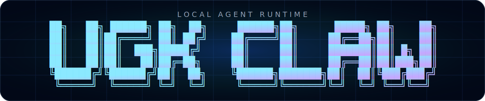
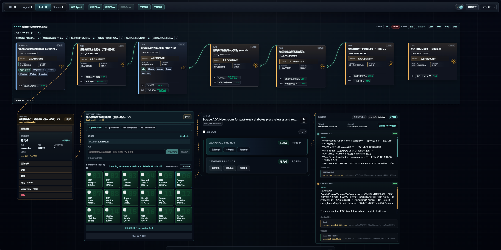
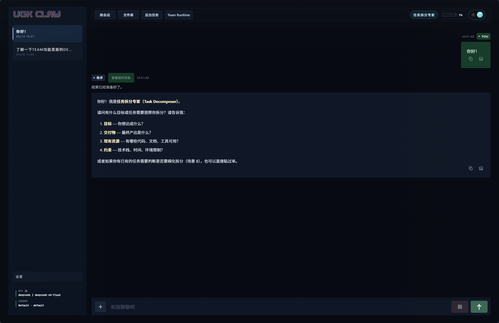
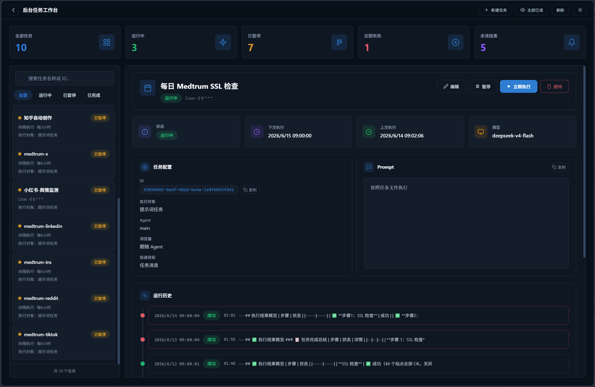
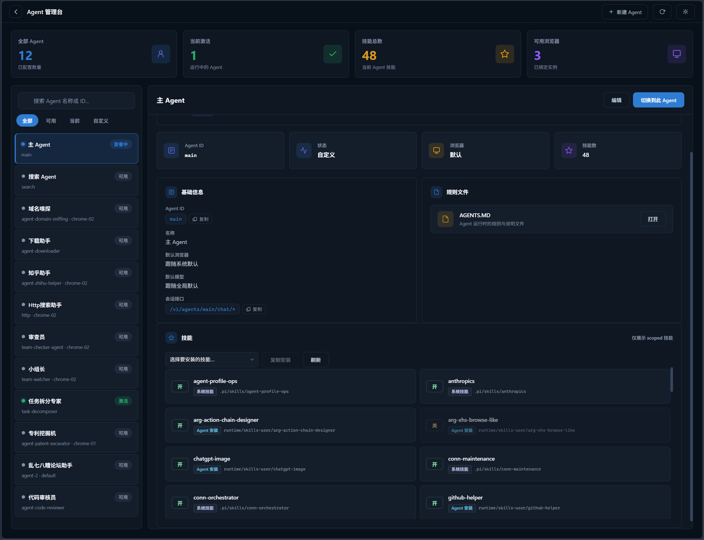
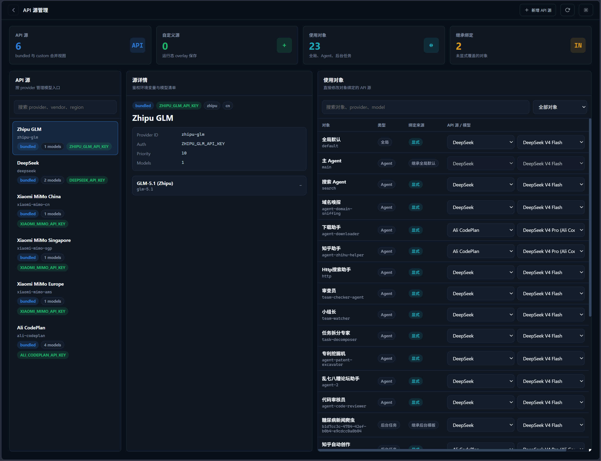

<p align="center">
  
</p>

<h1 align="center">UGK Mini Agent</h1>

<p align="center">
  本机部署的多 Agent Runtime
</p>

<p align="center">
  = 22" src="https://img.shields.io/badge/Node.js-%3E%3D22-339933?style=flat-square&logo=nodedotjs&logoColor=white">
  
  
</p>

<p align="center">
  <a href="#快速开始">快速开始</a> ·
  <a href="#功能预览">功能预览</a> ·
  <a href="docs/native-windows-core.md">Windows</a> ·
  <a href="docs/native-macos.md">macOS</a> ·
  <a href="docs/native-linux.md">Linux</a>
</p>

UGK Mini Agent 是一个可以在 Windows、macOS 和 Linux 本机运行的轻量 Agent Runtime。它把对话式 Agent、可视化任务画布、后台定时任务、Agent Profile、Skill 和 MCP 管理放在一个本地服务里，适合个人自动化、研究任务拆解、资料整理、周期性巡检和多 Agent 工作流实验。

本项目不预装任何模型密钥、私有 MCP 路径或云端依赖。你 clone 后在本机启动服务，自己配置模型 API 源、Agent、Skill 和 MCP server。



## 快速开始

按三步走：先检查环境，再安装项目，最后启动服务。默认端口是 `8888`。

### 第 1 步：检查必要配置

Windows 在 PowerShell 执行：

```powershell
git --version
node -v
npm -v
python --version
```

macOS / Linux 在终端执行：

```bash
git --version
node -v
npm -v
python3 --version
```

需要满足：

| 项目 | 要求 |
| --- | --- |
| Git | 能正常 clone GitHub 仓库 |
| Node.js | `v22` 或更新版本 |
| npm | 能正常执行 |
| Python | `3.11` 或 `3.12`，命令名建议为 `python3` |
| Linux 额外项 | 建议安装 `lsof`，用于自动检测和清理端口占用 |

如果某一项不存在，先按你的系统安装对应依赖。Linux 常见命令：

```bash
# Alibaba Cloud Linux / RHEL / Fedora
sudo dnf install -y git curl gcc gcc-c++ make lsof python3.11 python3.11-pip
curl -fsSL https://rpm.nodesource.com/setup_22.x | sudo bash -
sudo dnf install -y nodejs

# Ubuntu / Debian
sudo apt update
sudo apt install -y git curl build-essential lsof python3.11 python3.11-venv python3.11-pip
```

如果 Linux 系统自带 `python3` 是旧版本，例如 `3.6.x`，不要覆盖系统 Python。给当前用户加一个 PATH 优先级 shim：

```bash
mkdir -p ~/.local/bin
ln -sf /usr/bin/python3.11 ~/.local/bin/python3
echo 'export PATH="$HOME/.local/bin:$PATH"' >> ~/.bashrc
export PATH="$HOME/.local/bin:$PATH"
python3 --version
```

Windows 需要 Git for Windows，并确保包含 `Git\bin\bash.exe`。macOS 建议用 Homebrew 或官方安装包安装 Node.js 22+ 和 Python 3.11/3.12。

### 第 2 步：安装项目

下载仓库并安装依赖：

```bash
git clone https://github.com/mhgd3250905/ugk-mini-agent.git
cd ugk-mini-agent
npm install
npm --prefix apps/team-console install
```

然后按系统跑预检：

```bash
# Windows
npm run native:doctor

# macOS
npm run native:doctor:mac

# Linux
npm run native:doctor:linux
```

doctor 通过后再启动。新安装不会自带 provider 或 API key，启动后需要打开 `/playground/model-sources` 添加模型 API 源。

### 第 3 步：启动服务

#### Windows

```powershell
.\UGK-Mini-Agent-Launcher.cmd
```

#### macOS

```bash
chmod +x UGK-Mini-Agent-Launcher.command UGK-Mini-Agent-Set-Port.command
./UGK-Mini-Agent-Launcher.command
```

#### Linux 本机访问

```bash
chmod +x UGK-Mini-Agent-Launcher.sh UGK-Mini-Agent-Set-Port.sh
./UGK-Mini-Agent-Launcher.sh
```

#### Linux 服务器公网访问

```bash
./UGK-Mini-Agent-Launcher.sh --host 0.0.0.0
```

然后访问：

```text
http://服务器公网IP:8888/
http://服务器公网IP:8888/playground
http://服务器公网IP:8888/playground/team
```

如果浏览器打不开，先确认服务是否监听：

```bash
ss -lntp | grep 8888
```

能看到 `0.0.0.0:8888` 但外部仍打不开时，通常是云服务器安全组没有放行 TCP `8888`。

### 修改端口

默认端口是 `8888`。需要换端口时，可以使用交互式入口：

```powershell
# Windows
.\UGK-Mini-Agent-Set-Port.cmd
```

```bash
# macOS
./UGK-Mini-Agent-Set-Port.command

# Linux
./UGK-Mini-Agent-Set-Port.sh
```

也可以启动时直接传入端口：

```bash
./UGK-Mini-Agent-Launcher.command --port <port>
./UGK-Mini-Agent-Launcher.sh --port <port>
./UGK-Mini-Agent-Launcher.sh --host 0.0.0.0 --port <port>
```

如果改了端口，浏览器地址、安全组规则和 `PUBLIC_BASE_URL` 都要使用同一个端口。

### 公网 URL 配置

如果后续 artifact 链接、SSE 回调或前端资源需要公网 URL，编辑 `.env.native`：

```ini
HOST=0.0.0.0
PORT=8888
PUBLIC_BASE_URL=http://服务器公网IP:8888
```

然后用 supervisor 启动：

```bash
npm run native:start:linux
```

更详细的平台说明见 [Windows native guide](docs/native-windows-core.md)、[macOS native guide](docs/native-macos.md)、[Linux native guide](docs/native-linux.md)。

## 为什么用它

- **一个本地入口管理多种 Agent 工作流**：Chat、Team Canvas、Conn 后台任务和 Agent 管理都由同一个服务提供。
- **跨平台本机部署**：Windows、macOS、Linux 都有独立的启动脚本、doctor 检查和安装文档。
- **可视化任务编排**：用 Team Console 把复杂目标拆成 Discovery、Task、Split、Checker 等节点，并跟踪每一步运行结果。
- **后台任务自动执行**：Conn 支持后台、周期、定时任务，适合日报、监控、资料抓取、邮件处理等场景。
- **Agent Profile 隔离**：不同 Agent 可以拥有不同技能、规则和 MCP server，避免工具和上下文混在一起。
- **运行态数据留在本机**：会话、配置、日志、模型源和 MCP 配置默认写入本地 `.data/`，不进入仓库。

## 功能预览

### Chat 工作台



### Team Canvas 任务画布


### Conn 后台任务



### Agent Profile 与技能



### API 源管理



## 页面入口

默认服务地址由 `.env.native` 里的 `PUBLIC_BASE_URL`、`HOST`、`PORT` 推导。常用入口：

| 页面 | 路由 | 用途 |
| --- | --- | --- |
| 首页 | `/` | 导航入口 |
| Chat | `/playground` | Agent 对话、文件、运行日志 |
| Team Console | `/playground/team` | 多 Agent 任务画布 |
| API 源 | `/playground/model-sources` | 模型 provider 和 API key 管理 |
| Agent 管理 | `/playground/agents` | Agent Profile、Skill、MCP 管理 |
| 后台任务 | `/playground/conn` | Conn 周期任务和运行记录 |

## 核心概念

### Agent Profile

Agent Profile 是一个可切换的 Agent 配置单元。每个 Agent 可以拥有自己的名称、默认模型、规则文件、Skill 和 MCP server。Chat、Conn 和 Team Task 使用某个 Agent 时，只会注入该 Agent 已启用的能力。

### Team Canvas

Team Canvas 用画布表达复杂任务流。你可以创建 Task、Discovery、Split、Source 等节点，把长任务拆成可观察、可重跑、可审查的步骤，并查看每个 worker/checker 的日志和 artifact。

### Conn 后台任务

Conn 用来管理后台任务、周期任务和定时任务。它适合把已经稳定的 Agent 能力放到后台执行，例如每天检查页面、整理资料、处理邮件、生成报告。

### Skill 与 MCP

Skill 是项目或用户安装的本地能力包；MCP server 是用户自己添加的运行态工具服务。UGK Mini Agent 不预装你的私有 MCP 路径，也不会自动探测 OCR、浏览器、数据库等外部工具。MCP 的 command、cwd、env 和密钥都只写入本地运行态配置。

## 本地数据与安全

默认运行态目录：

| 目录 | 内容 |
| --- | --- |
| `.data/agent/` | 会话、资产、模型设置、main Agent MCP 配置 |
| `.data/agents/` | 自定义 Agent Profile |
| `.data/team/` | Team Canvas run state |
| `logs/native/` | supervisor 和子进程日志 |
| `.data/tools/` | 本地工具缓存 |

这些内容不会提交到仓库。公开部署或绑定 `HOST=0.0.0.0` 前，请注意：

- 不要把 `.env.native`、`.data/`、`logs/`、API key 或 MCP 私有路径提交到 Git。
- MCP 管理 API 默认只接受本机请求；如果要放到反向代理或公网后面，必须先加认证和访问控制。
- 对外访问建议显式设置 `PUBLIC_BASE_URL`，避免 artifact 链接继续指向 `127.0.0.1`。

## 开发者文档

| 文档 | 说明 |
| --- | --- |
| [AGENTS.md](AGENTS.md) | AI Agent 协作规则、关键文件和验证命令 |
| [CONTRIBUTING.md](CONTRIBUTING.md) | 开发贡献指南 |
| [docs/native-windows-core.md](docs/native-windows-core.md) | Windows 本机运行技术参考 |
| [docs/native-macos.md](docs/native-macos.md) | macOS 安装与启动 |
| [docs/native-linux.md](docs/native-linux.md) | Linux 安装与启动 |
| [docs/team-runtime.md](docs/team-runtime.md) | Team Runtime 技术文档 |
| [docs/playground-current.md](docs/playground-current.md) | Playground UI 文档 |
| [docs/architecture-test-matrix.md](docs/architecture-test-matrix.md) | 按改动范围选择验证命令 |

## 常用开发命令

```bash
npm run native:doctor          # Windows doctor
npm run native:doctor:mac      # macOS doctor
npm run native:doctor:linux    # Linux doctor

npm run native:start           # Windows / 默认 native supervisor
npm run native:start:mac       # macOS native supervisor
npm run native:start:linux     # Linux native supervisor

npm run dev                    # 热重载主服务
npm run team-console:build     # 构建 Team Console
npm test                       # 全量测试
npx tsc --noEmit               # 类型检查
```

## 项目状态

UGK Mini Agent 当前以本机部署为主，Windows、macOS 和 Linux 已具备独立安装入口。macOS 与 Linux 的真实安装启动已完成初步验证；更多发行版、反向代理和公网部署细节会继续补充。
