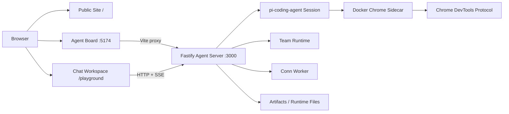

<p align="center">
  
</p>

<h1 align="center">UGK CLAW</h1>

<p align="center">
  <strong>面向生产环境的 Agent 任务验收与编排工作台。</strong><br>
  用干净 Task、可复用 Skill、Worker 执行留痕和 Checker 审核，把 Agent 输出变成可交付的工作单元。
</p>

<p align="center">
  
  = 22">
  
  
  
  
</p>

<p align="center">
  <a href="./README.md">中文</a>
  ·
  <a href="./README.en.md">English</a>
  ·
  <a href="./apps/team-console/README.md">Agent 画板</a>
  ·
  <a href="./docs/team-runtime.md">Team Runtime</a>
  ·
  <a href="./docs/playground-current.md">Playground</a>
  ·
  <a href="./docs/server-ops.md">运维</a>
</p>

---

## 目录

- [为什么需要 UGK CLAW](#为什么需要-ugk-claw)
- [可信 Task 交付](#可信-task-交付)
- [产品界面](#产品界面)
- [核心能力](#核心能力)
- [系统架构](#系统架构)
- [快速开始](#快速开始)
- [你该先看什么](#你该先看什么)
- [开发指南](#开发指南)
- [项目结构](#项目结构)
- [文档索引](#文档索引)
- [当前状态](#当前状态)
- [贡献规则](#贡献规则)
- [License](#license)

## 为什么需要 UGK CLAW

直接把 LLM 或 Agent 对话接进生产流程，最大的问题不是“模型不够聪明”，而是 **结果没有验收边界**。

即使模型能力很强，也仍然可能出现幻觉、漏项、误读上下文、伪造结果。更现实的是，低成本模型经常不是不会做，而是在自动任务里不稳定、不完全遵从要求，甚至偷工减料。只要任务结果没有可回看的执行证据和独立审核，哪怕只有 1% 的不可信，也不应该进入交付链路。

UGK CLAW 的设计目标是把 Agent 工作从“模型回答了什么”推进到“任务是否可交付”：

- 把复杂能力沉淀成可复用 Skill。
- 每次运行都进入干净 Task，避免长对话上下文污染。
- Worker 负责执行，并留下状态、文件、中间产物和错误信息。
- Checker 按任务要求验收结果，拦截幻觉、漏项和伪造证据。
- 通过验收的 Task 才适合串联或并联成 Workflow。

## 可信 Task 交付

UGK CLAW 的核心抽象不是 prompt，而是可以验收的 Task。

| 组成 | 职责 |
| --- | --- |
| Task | 一个干净会话，携带目标、约束、输入资料、完整 Skill 和期望产物 |
| Skill | 从对话中沉淀出来的可复用能力，避免每次重新解释复杂任务 |
| Leader | 拆解目标、澄清边界、组织资料和角色 |
| Worker | 在 Task 环境里执行具体工作，并保留过程证据 |
| Checker | 对照任务要求审核结果，拦截幻觉、漏项、偷工减料和伪造证据 |
| Workflow | 把通过验收的 Task 串联或并联，组成更复杂的任务链路 |

Task 的本质是：

```text
干净会话 + 完整 Skill + 必要资料 + 验收标准
```

这让可复用能力不再依赖一段越来越脏的长对话，也让每次运行都有明确的输入、输出和验收条件。

## 产品界面

Agent 画板是当前最适合作为第一入口的产品界面。它把 Agent、Task、Source、依赖、运行观察和产物证据放在同一个工作面上，让开发者先看清系统如何组织工作，再进入具体 Agent 对话。

<p align="center">
  
</p>

早期的 Chat 工作台仍然保留，用于单 Agent 对话、文件库、后台任务、模型设置、飞书设置和 Chrome 工作台。它不再是最好的项目第一解释，但仍是核心开发入口之一。

## 核心能力

| 能力 | 说明 |
| --- | --- |
| Agent 画板 | 在一张图上查看 Agent、Task、Source、typed ports、control dependency 和 run observer |
| 工作小组角色 | Leader / Worker / Checker 可绑定不同 Agent profile，让执行和验收分离 |
| 干净 Task | 每次运行从明确边界启动，减少长对话上下文污染 |
| Skill 复用 | 把对话中验证过的复杂能力沉淀为可复用任务能力 |
| Checker 审核 | 按任务要求检查输出、证据、错误和遗漏，形成验收闭环 |
| Typed Task Chain | 用输入/输出端口连接 Task，让通过验收的结果进入下游任务 |
| Source 输入 | 文本、文件等 Source 节点可连接到 Task input port，作为显式运行输入 |
| Run evidence | Worker 过程、Checker 过程、输出文件和 result 文件围绕 Task 归档 |
| Chat 工作台 | 流式对话、历史会话、文件库、后台 Conn 任务、模型设置和 Chrome 控制 |
| Chrome sidecar | Docker Chrome + CDP，支持持久 profile、登录态复用和多实例隔离 |
| 自托管部署 | 本地 Docker Compose 跑通，生产可通过 nginx/HTTPS 反代部署 |

## 系统架构



默认浏览器链路：

```text
agent / skill
  -> direct_cdp
  -> LocalCdpBrowser
  -> 172.31.250.10:9223
  -> Docker Chrome sidecar
```

## 快速开始

### 环境要求

- Node.js 22+
- Docker 和 Docker Compose
- 至少一个可用模型凭据，按 `.env.example` 配置

### 本地启动

```bash
git clone https://github.com/mhgd3250905/ugk-claw-personal.git
cd ugk-claw-personal
npm install
docker compose up -d
```

启动后常用入口：

| 入口 | 地址 | 用途 |
| --- | --- | --- |
| Agent 画板 | `http://127.0.0.1:5174/` | 第一体验入口，查看 Agent / Task / Source 和运行证据 |
| 官网首页 | `http://127.0.0.1:3000/` | 产品介绍页 |
| Chat 工作台 | `http://127.0.0.1:3000/playground` | 单 Agent 对话、文件库、后台任务和运行设置 |
| Chrome sidecar GUI | `https://127.0.0.1:3901/` | 默认浏览器实例 GUI |

`5174` 是 Agent 画板前端入口，`3000` 是主服务、Playground、API、文件和 runtime。Docker Compose 会让 Agent 画板代理主服务的 `/v1`、`/playground`、`/assets`、`/runtime` 等路径。

### 生产式启动

```bash
cp .env.example .env
docker compose -f docker-compose.prod.yml up --build -d
```

生产环境建议把 `.data`、用户 skills、Chrome profile、日志和模型设置放到独立 shared 目录，不要混进 Git 工作树。详细部署边界见 [Server Ops](./docs/server-ops.md)。

## 你该先看什么

### 1. Agent 画板

先打开 `http://127.0.0.1:5174/`。Agent 画板会展示 Agent、Task 和 Source 节点。你可以从任务卡片看到 Leader、Worker、Checker 的分工，也可以切换 mock fixture 和 Live API。

Agent 画板适合回答这些问题：

- 当前有哪些 Agent？
- 哪些 Task 可以运行？
- 输入从哪里来，输出交给谁？
- Worker 执行过程和 Checker 审核过程在哪里？
- 运行失败时证据和错误在哪里？
- 多 Agent 分工是否真的可见？

### 2. Task 分支和 Run observer

点击 Task 后展开运行观察。Worker 过程、Checker 过程、输出文件、结果文件会围绕当前 Task 展示。这个视角按任务归档证据，不需要在长对话里翻找上下文。

### 3. Chat 工作台

当你需要和某个 Agent 沟通细节，再进入 `/playground` 或 Agent 画板中的 Agent iframe。Chat 工作台负责流式对话、历史会话、文件库、后台 Conn 任务、模型源设置、飞书设置和 Chrome 工作台。

## 开发指南

### 常用命令

```bash
npm test
npx tsc --noEmit
npm run design:lint
npm run team-console:test
npm run team-console:build
npm run docker:chrome:check
```

### 本地开发服务

```bash
npm run start
npm run team-console:dev
```

如果主服务不在默认地址，可通过 `TEAM_CONSOLE_API_TARGET` 覆盖 Team Console 的代理目标：

```bash
TEAM_CONSOLE_API_TARGET=http://127.0.0.1:<port> npm run team-console:dev
```

### Docker 开发

普通源码变更多数情况下重启主服务即可：

```bash
docker compose restart ugk-pi
```

改 `Dockerfile`、依赖、compose 或容器级工具时需要重建：

```bash
docker compose up --build -d
```

### 配置

关键配置来自 `.env.example`：

| 配置 | 说明 |
| --- | --- |
| `ZHIPU_GLM_API_KEY` / `DEEPSEEK_API_KEY` / `XIAOMI_MIMO_API_KEY` | 模型供应商凭据 |
| `TEAM_RUNTIME_ENABLED` | 是否启用 `/v1/team/*` 路由和 team worker |
| `TEAM_DATA_DIR` | Team Runtime 数据目录 |
| `TEAM_REAL_ROLES` | 哪些 Team role 使用真实 LLM |
| `UGK_BROWSER_INSTANCES_JSON` | Chrome sidecar 实例注册 |
| `PUBLIC_BASE_URL` | 生产公网 base URL |
| `FEISHU_*` | 飞书集成配置 |
| `UGK_RUNTIME_SKILLS_USER_DIR` | 用户 skills 挂载目录 |
| `UGK_RUNTIME_DEPS_HOST_DIR` | 共享 Python venv / runtime 依赖缓存 |

## 项目结构

```text
.
├── apps/team-console/        # Agent 画板，React + Vite + TypeScript
├── src/
│   ├── agent/                # Agent service、会话、资产、模型配置
│   ├── browser/              # Chrome sidecar / CDP 绑定
│   ├── routes/               # Fastify HTTP routes
│   ├── team/                 # Team Runtime、Task、Run、Source、Typed chain
│   ├── ui/                   # 官网首页和 Playground HTML UI
│   └── workers/              # Conn worker、Team worker、Feishu worker
├── docs/                     # 架构、运行、部署和变更文档
├── deploy/                   # 部署相关配置
├── runtime/                  # runtime skills 和运行时公开资产
├── scripts/                  # 运维、检查、sidecar、维护脚本
├── test/                     # Node test suites
└── docker-compose*.yml       # 本地与生产 compose
```

## 文档索引

| 文档 | 适合谁看 |
| --- | --- |
| [Agent 画板 README](./apps/team-console/README.md) | 想理解 Agent 画板、Live API、iframe 和运行观察的人 |
| [Team Runtime](./docs/team-runtime.md) | 改 Task、Workflow、Run、Source、Typed chain 后端的人 |
| [Playground Current](./docs/playground-current.md) | 改 Chat 工作台的人 |
| [Browser Bridge](./docs/web-access-browser-bridge.md) | 排查 Chrome sidecar / CDP 链路的人 |
| [Server Ops](./docs/server-ops.md) | 部署和运维的人 |
| [Model Providers](./docs/model-providers.md) | 配模型源和默认模型的人 |
| [Architecture Governance](./docs/architecture-governance-guide.md) | 接手架构演进和边界治理的人 |
| [Change Log](./docs/change-log.md) | 想看最近变更的人 |
| [AGENTS.md](./AGENTS.md) | 让 coding agent 接手代码前必须读 |

## 当前状态

UGK CLAW 仍在快速演进。当前公开展示时请保持诚实边界：

- Agent 画板是当前第一产品入口。
- Chat 工作台仍是成熟的单 Agent 对话与运行设置入口。
- Team Runtime、Canvas Task run、Source node、Typed Task Chain 已建立基础契约。
- 目前没有适合公开展示的真实 Workflow demo，因此文档和官网不会伪造“深度研究工作流已可用”。
- 生产部署需要自行处理域名、HTTPS、反向代理、认证、运行态持久化和备份。

## 贡献规则

这个项目按协作分支开发，不直接改 `main`。

推荐流程：

```bash
git fetch origin
git checkout -b <your-branch> origin/main
```

提交前至少运行：

```bash
npx tsc --noEmit
npm run design:lint
npm test
```

如果只改 Team Console，至少运行：

```bash
npm run team-console:test
npm run team-console:build
```

PR 需要说明：

- 改了什么用户行为或开发者接口。
- 是否影响 `/`、`/playground`、`/v1`、Team Console 或 Team Runtime。
- 是否新增、删除或改变数据结构。
- 跑过哪些检查。

不要提交：

- `.env`
- `.data/`
- Chrome profile
- runtime 临时报告或截图
- 部署包、日志、一次性调试输出
- 生产服务器 shared 目录内容

## FAQ

<details>
<summary><strong>为什么把 Agent 画板作为第一入口？</strong></summary>

因为新用户首先要理解系统结构，而不是面对一个空聊天框。Agent 画板能直接展示 Agent、Task、Source、依赖和运行证据，学习路径更短。
</details>

<details>
<summary><strong>那 `/playground` 还重要吗？</strong></summary>

重要。`/playground` 是 Chat 工作台，负责单 Agent 对话、文件库、后台任务、模型源、飞书设置和 Chrome 工作台。它只是退到更合适的位置：当用户已经知道要和哪个 Agent 沟通时再打开。
</details>

<details>
<summary><strong>5174 能直接部署成公网入口吗？</strong></summary>

当前没有把 5174 单独定义为公网产品入口。公网部署需要反向代理、生产 compose、HTTPS、认证和明确的公网 base URL。开发态不要把用户浏览器导向开发机自己的 loopback 地址。
</details>

<details>
<summary><strong>能在 Windows 上开发吗？</strong></summary>

能。当前本地开发环境就是 Windows + Docker Desktop。生产部署建议 Linux + nginx + HTTPS。
</details>

<details>
<summary><strong>为什么强调 Checker？</strong></summary>

因为 Agent 自动化不是“模型说完成了”就算完成。Checker 把任务要求、输出、错误和证据放进同一条验收链路，目标是把不稳定模型输出拦在交付之前。
</details>

## License

MIT
